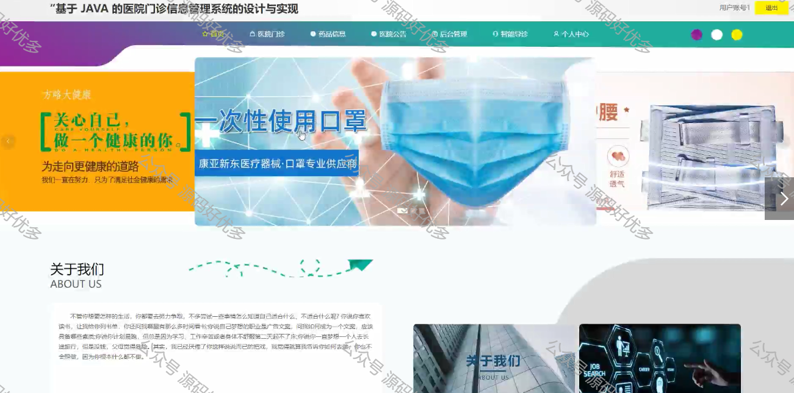
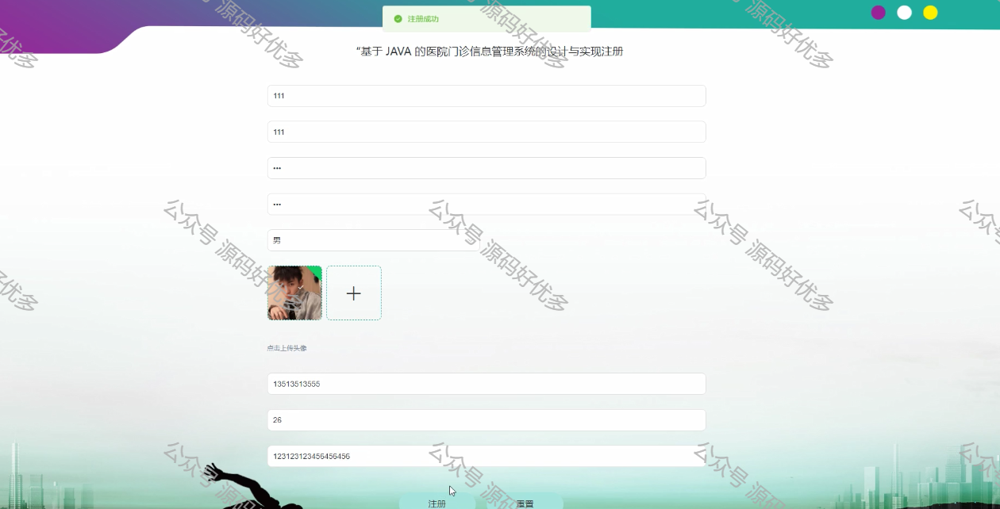
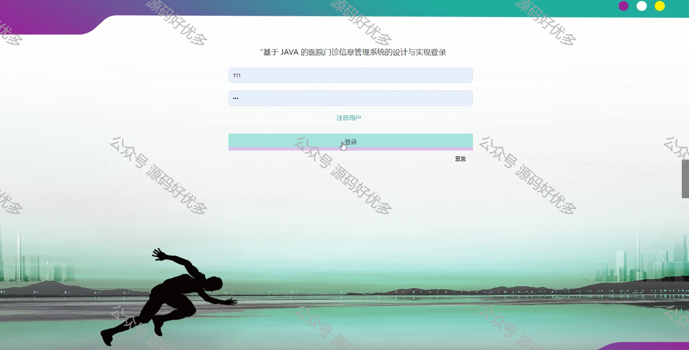
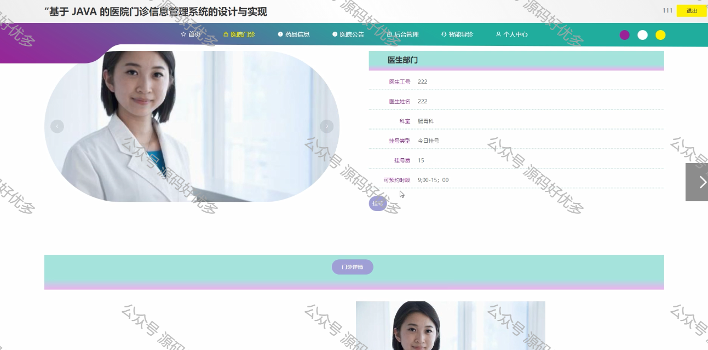
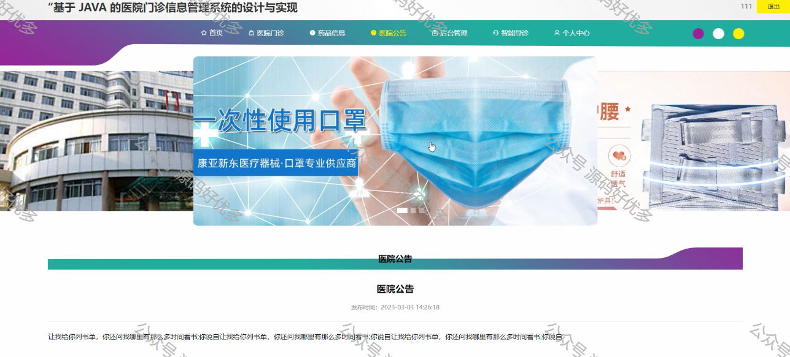
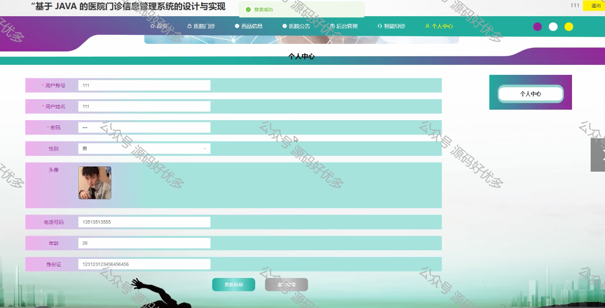
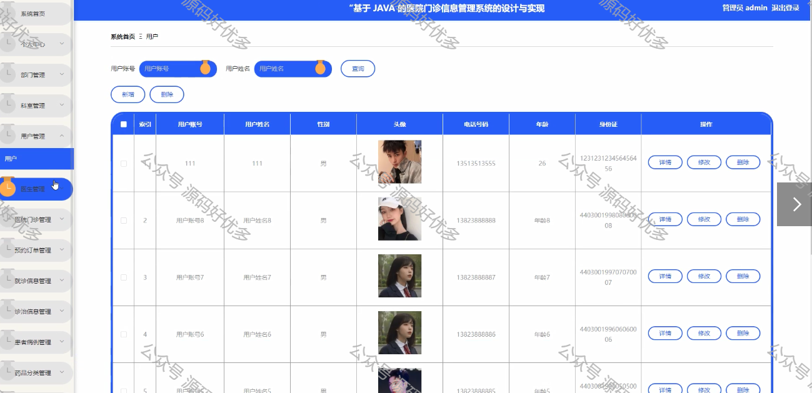
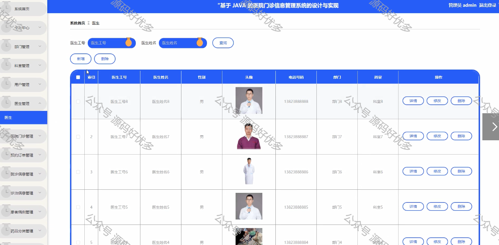

 
## 查看主页获取源码

> **作者介绍**： **✌**全网粉丝10W+本平台特邀作者、博客专家、CSDN新星计划导师、java领域优质创作者,博客之星、掘金/华为云/阿里云/InfoQ等平台优质作者、专注于毕业项目实战 **✌**

  

### 一、作品包含

源码+数据库+设计文档万字LW+PPT+全套环境和工具资源+部署教程

### 二、项目技术

前端技术：Html、Css、Js、Vue、Element-ui

数据库：MySQL

后端技术：Java、Spring Boot、MyBatis

  

### 三、运行环境

开发工具：IDEA/eclipse

数据库：MySQL5.7

数据库管理工具：Navicat10以上版本

环境配置软件： JDK1.8+Maven3.6.3

前端Nodejs：14

  

### 四、项目介绍
项目编号：springbootA064

近年来，人们的生活方式以网络为主题不断进化，医院门诊信息就是其中的一部分。现在，无论是大型的还是小型的网站，都随处可见，不知不觉中已经成为我们生活中不可或缺的存在。随着社会的发展，除了对系统的需求外，我们还要促进经济发展，提高工作效率，同时还要做好对预约订单、就诊信息、诊治信息、患者病历、药品信息等管理，网络广泛化的运用使信息技术快速发展。在保证高效率的基础上，要保证用户便捷在线查看医生进行预约就诊等[1]。目前，由代码编程实现的各种管理工具和系统替代传统的人工操作，不但提升了可靠性还降低了人力成本，节省了时间，提升了工作效率。全球视域下信息技术逐步渗透到各个领域，多样化的数据信息为医院门诊信息带来了深刻变革。电子商务是新时代发展的一种产品，它是一种被广泛接受的、顺应时代潮流的新型管理模式。它有助于改变现状，提高工作效率，加强专业化、信息化、规范化管理，在这个阶段，医院门诊信息管理系统为提高整体工作效率的一种方式，它是医院经济的基础。

### 五、运行截图

